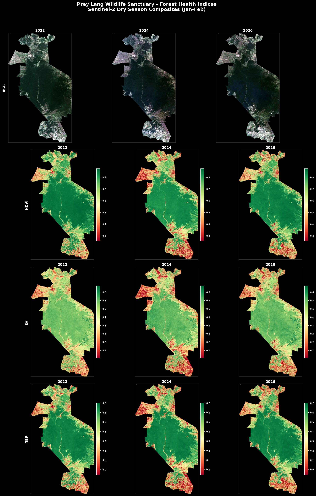
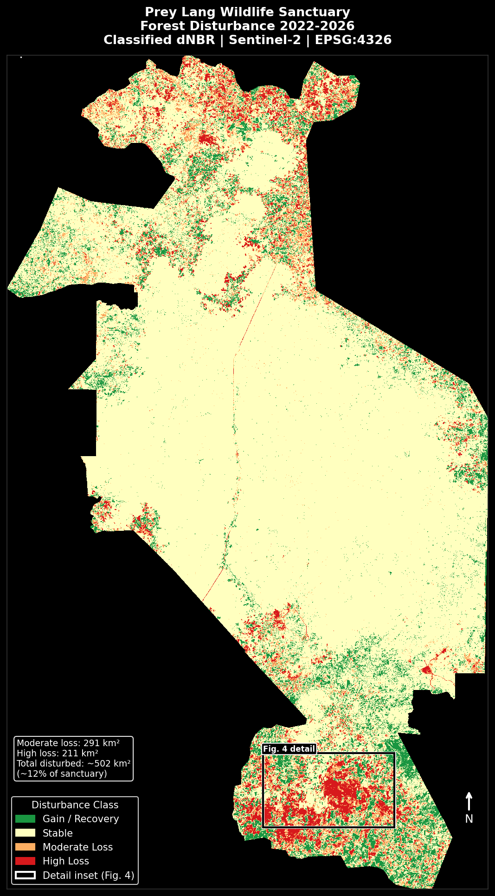
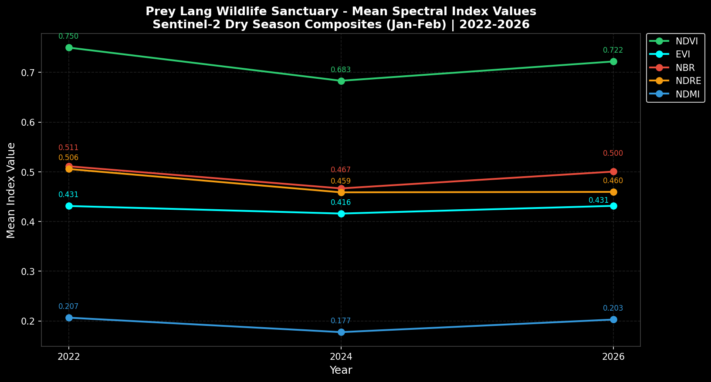
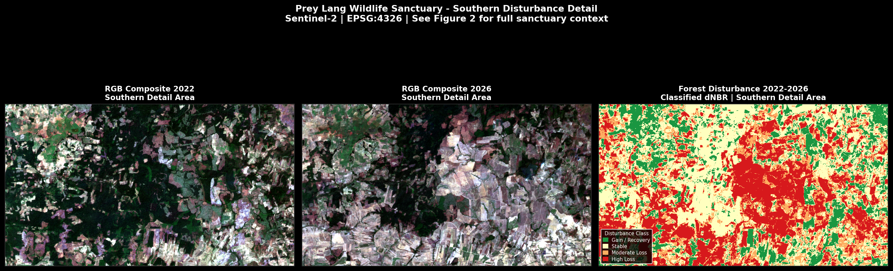

# Prey Lang Wildlife Sanctuary - Forest Health & Disturbance Monitoring
## Multi-Index Sentinel-2 Analysis via Google Earth Engine | Cambodia | 2022-2026

---

## Project Overview

This project builds and executes a full end-to-end forest health monitoring pipeline over Prey Lang Wildlife Sanctuary in central Cambodia, using multi-temporal Sentinel-2 imagery processed via Google Earth Engine (GEE). The analysis covers three dry season composites spanning 2022, 2024 and 2026, detecting forest disturbance and partial recovery patterns across one of Southeast Asia's most ecologically significant lowland evergreen forest blocks.

The project demonstrates multi-index spectral analysis and change detection workflows applied to a tropical forest monitoring context. Prey Lang is subject to documented illegal logging pressure, making it a relevant and challenging study area for forest disturbance detection and vegetation health assessment over time.

---

## Study Area

**Prey Lang Wildlife Sanctuary**, Cambodia (WDPA ID: 555703480)

One of the most ecologically significant lowland evergreen forests in mainland Southeast Asia, covering approximately 4,900 km² across four provinces in central Cambodia. The sanctuary has been subject to significant and well-documented illegal logging pressure over the past decade, making it a relevant and challenging study area for forest disturbance monitoring.

The study area boundary was sourced from the World Database on Protected Areas (WDPA) via [protectedplanet.net](https://www.protectedplanet.net) and imported as a GEE asset.

---

## Methodology

### Data Source

Sentinel-2 Level-2A surface reflectance imagery accessed via the GEE public archive (`COPERNICUS/S2_SR_HARMONIZED`). No local data download was required - all processing runs server-side on Google's infrastructure.

### Temporal Coverage

Three dry season composite windows were selected to capture year-on-year change at consistent two-year intervals:

| Composite | Window | Scenes available |
|-----------|--------|-----------------|
| 2022 | January - February 2022 | 10 |
| 2024 | January - February 2024 | 14 |
| 2026 | January - February 2026 | 14 |

Cambodia's dry season runs November to April. January-February was selected to minimise cloud cover and ensure consistent phenological conditions across all three composites.

### Cloud Masking and Compositing

Each composite was built from all available Sentinel-2 acquisitions within the date window with tile cloud cover below 20%. Cloud and cirrus pixels were masked per-scene using the QA60 bitmask band (bits 10 and 11). A pixel-level median composite was then computed across all masked acquisitions within the window.

This median compositing approach is methodologically superior to single-scene selection for tropical forest monitoring, where individual scenes are rarely fully cloud-free. By aggregating across multiple acquisitions, residual cloud contamination is statistically suppressed and the resulting composite is more representative of true surface conditions.

### Spectral Indices

Five spectral indices were calculated for each composite:

| Index | Formula | Purpose |
|-------|---------|---------|
| NDVI | (B8 - B4) / (B8 + B4) | General vegetation health and canopy density |
| EVI | 2.5 × (B8 - B4) / (B8 + 6×B4 - 7.5×B2 + 1) | Enhanced vegetation index - reduced saturation in dense tropical canopy compared to NDVI |
| NBR | (B8 - B12) / (B8 + B12) | Disturbance detection, deforestation and fire scarring |
| NDRE | (B8 - B5) / (B8 + B5) | Canopy chlorophyll content - sensitive to early stress before structural changes are visible |
| NDMI | (B8 - B11) / (B8 + B11) | Canopy moisture content - drought stress and forest health |

EVI was specifically selected for this tropical forest context because NDVI saturates in high-biomass dense canopy conditions. EVI maintains sensitivity across the full range of tropical forest canopy density.

### Change Detection

Difference rasters (dNBR, dNDVI) were calculated between temporal composites using the convention of earlier minus later, such that positive values indicate a decrease in index value (disturbance or loss) and negative values indicate an increase (recovery or gain).

The dNBR 2022-2026 layer was classified into four disturbance severity classes:

| Class | dNBR threshold | Interpretation |
|-------|---------------|----------------|
| Gain / Recovery | < -0.1 | Increase in NBR - vegetation recovery or regrowth |
| Stable | -0.1 to 0.1 | No significant change |
| Moderate Loss | 0.1 to 0.3 | Detectable forest degradation or partial clearing |
| High Loss | > 0.3 | Severe disturbance, likely clearing or fire |

The classification thresholds are adapted from Key and Benson (2006) - Landscape Assessment: Ground measure of severity, the Composite Burn Index, and remote sensing of severity - and adjusted for tropical forest context following published guidance on NBR-based disturbance detection in Southeast Asian forest systems.

### Two-Phase Workflow

The analysis was conducted in two phases to demonstrate both interactive GEE exploration and reproducible scripted pipeline development:

**Phase 1 - GEE Code Editor (JavaScript):** Interactive exploration of imagery, index visualisation and change detection using the browser-based GEE Code Editor. This phase served as the reference analysis and validated the methodology before scripting. Shareable links to all six JavaScript scripts are provided below.

**Phase 2 - GEE Python API pipeline:** The same analysis reproduced as a standalone Python script using the `earthengine-api` package. This pipeline loads the study area boundary, builds composites, calculates all indices, runs change detection, computes zonal statistics and exports GeoTIFFs to Google Drive. Outputs from both phases were cross-validated and match to three decimal places.

---

## Results

### Index Trends 2022-2026

All five indices show a consistent pattern of disturbance concentrated in the 2022-2024 interval followed by partial recovery in 2024-2026:

| Index | 2022 | 2024 | 2026 |
|-------|------|------|------|
| NDVI | 0.750 | 0.683 | 0.722 |
| NBR | 0.511 | 0.467 | 0.500 |
| NDRE | 0.506 | 0.459 | 0.460 |
| EVI | 0.431 | 0.416 | 0.432 |
| NDMI | 0.207 | 0.178 | 0.203 |

NDRE is notable for its minimal recovery between 2024 and 2026 (0.459 to 0.460), suggesting that canopy chlorophyll content has not recovered even in areas where structural regrowth is underway. This is consistent with secondary forest dynamics, where structural regrowth typically precedes recovery of canopy biochemistry.

### Disturbance Extent

Analysis of the classified dNBR layer for the full 2022-2026 period:

| Class | Area (km²) | % of sanctuary |
|-------|-----------|----------------|
| Gain / Recovery | 388 | 8.0% |
| Stable | 3,429 | 70.5% |
| Moderate Loss | 291 | 6.0% |
| High Loss | 211 | 4.3% |
| **Total disturbed** | **502** | **~12%** |

Disturbance is spatially concentrated at the northern edge and southern portion of the sanctuary, consistent with documented illegal logging activity along access routes and the sanctuary boundary.

---

## Limitations

Zonal statistics are computed across the full WDPA boundary polygon, which includes minor areas of water, settlement edges and agricultural land in addition to closed canopy forest. The index means therefore represent conditions across the full protected area rather than forested pixels exclusively. A forest mask derived from a global forest cover product such as Hansen Global Forest Change would refine these statistics to forested pixels only in future iterations of this analysis.

Spatial resolution of 20m means clearings smaller than approximately 400m² may not be reliably detected. The dNBR classification thresholds carry inherent uncertainty for pixels with values close to class boundaries. No field validation data was used in this analysis.

This analysis focuses on forest disturbance detection and vegetation health monitoring via spectral indices and change detection. It does not include above-ground biomass estimation, carbon stock quantification or additionality calculations. The disturbance detection and temporal monitoring pipeline demonstrated here represents the remote sensing component that would underpin a broader carbon project MRV workflow, but does not constitute a carbon estimation methodology in itself.

---

## Map Outputs

### Figure 1 - Forest Health Indices 2022-2026



### Figure 2 - Forest Disturbance 2022-2026



### Figure 3 - Mean Index Values 2022-2026



### Figure 4 - Southern Disturbance Detail



---

## GEE Code Editor Scripts

The following scripts can be opened and run directly in the GEE Code Editor without any local setup. A Google Earth Engine account is required.

GEE Project: [preylangcambodia](https://code.earthengine.google.com/?project=preylangcambodia)

| Script | Description | Link |
|--------|-------------|------|
| 01_orientation_test | Connectivity test, Sentinel-2 access confirmation | [Open](https://code.earthengine.google.com/4b89f5f6f011084b7c8779c9982515a7) |
| 02_boundary_check | Load and display Prey Lang WDPA boundary | [Open](https://code.earthengine.google.com/72de5bfb3940c970ea418c82dab3d948) |
| 03_composite_explorer | Build and visualise median composites for all three years | [Open](https://code.earthengine.google.com/5d2072842e495be791f201b137015dae) |
| 04_index_calculations | Calculate and visualise all five spectral indices | [Open](https://code.earthengine.google.com/6884fb997f016945b5fab8ae2fb2113e) |
| 05_change_detection | dNBR change detection and disturbance classification | [Open](https://code.earthengine.google.com/f95319f00d333752fb4cee972486639b) |
| 06_zonal_statistics | Zonal statistics and CSV export | [Open](https://code.earthengine.google.com/34b89cefdbc788fe5df982fcdb871e1e) |

---

## Running the Python Pipeline

### Requirements

```
earthengine-api
geopandas
numpy
matplotlib
rasterio
Pillow
```

```bash
pip install -r requirements.txt
```

### Authentication

```bash
earthengine authenticate
```

Sign in with a Google account that has GEE access. Authentication is a one-time step per machine.

Note: update the `project` parameter in `ee.Initialize()` to match your own GEE Cloud project before running.

### Running the pipeline

```bash
python scripts/pipeline.py
```

The pipeline will:
1. Initialise GEE with the `preylangcambodia` Cloud project
2. Load the study area boundary from the local shapefile
3. Build cloud-masked median composites for 2022, 2024 and 2026
4. Calculate all five spectral indices
5. Compute change detection rasters and classify disturbance severity
6. Print zonal statistics to the terminal
7. Submit eight GeoTIFF export tasks to Google Drive (folder: `PreyLangCambodia`)

Monitor export progress at [code.earthengine.google.com/tasks](https://code.earthengine.google.com/tasks). Exports typically complete within 20-30 minutes.

### Producing map outputs

Once GeoTIFFs are downloaded from Google Drive to `outputs/geotiffs/`:

```bash
python scripts/map_outputs.py
```

Figures are saved to `outputs/figures/`.

---

## Data Sources

| Dataset | Source |
|---------|--------|
| Sentinel-2 L2A imagery | GEE public archive: `COPERNICUS/S2_SR_HARMONIZED` |
| Study area boundary | WDPA via [protectedplanet.net](https://www.protectedplanet.net) (WDPA ID: 555703480) |
| Reference context | Global Forest Watch, Hansen Global Forest Change |
